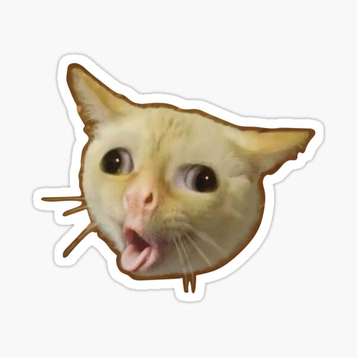

# Cat Cough (HAIRBALL) 

### How to Buy CatCough (HAIRBALL)

### Find us Online

- Telegram
- www.catcough.com
- OpenSea

### Learn More

A few articles we recommend for those interested in Smart Contract development. 

* [The Hitchhiker’s Guide to Smart Contracts in Ethereum](https://blog.openzeppelin.com/the-hitchhikers-guide-to-smart-contracts-in-ethereum-848f08001f05) will help you get an overview of the various tools available for smart contract development, and help you set up your environment.
* [A Gentle Introduction to Ethereum Programming, Part 1](https://blog.openzeppelin.com/a-gentle-introduction-to-ethereum-programming-part-1-783cc7796094) provides very useful information on an introductory level, including many basic concepts from the Ethereum platform.
* For a more in-depth dive, you may read the guide [Designing the Architecture for Your Ethereum Application](https://blog.openzeppelin.com/designing-the-architecture-for-your-ethereum-application-9cec086f8317), which discusses how to better structure your application and its relationship to the real world.

### License

CatCough Contract is released under the [MIT License](LICENSE).

